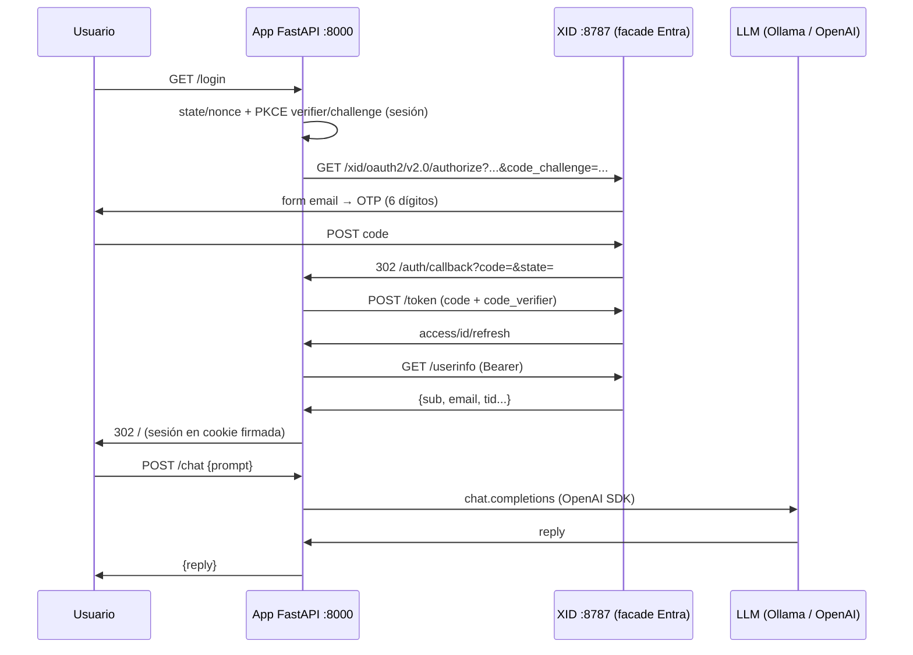

# Fast-API-AI

> WebApp on Python/FastAPI + OpenAI/Ollama + OAuth (OnMind-XID/Entra-ID)

App de ejemplo con FastAPI mínima que autentica vía **OnMind-XID** (simulando Entra ID)
y expone un chat protegido que llama al LLM.  
Por defecto usa **Ollama local** (`gemma4:e4b-mlx`) vía endpoint compatible
OpenAI; cambiando `LLM_PROVIDER=openai` usa la **OpenAI API** (`gpt-4o-mini`).

## Estructura

```bash
./
├── main.py               # FastAPI + SessionMiddleware, incluye router
├── router.py             # agregador: views + auth + chat
├── endpoints/
│   ├── views.py          # GET / (chat HTML) + GET /health
│   ├── auth.py           # /login, /auth/callback, /me, /logout
│   └── chat.py           # POST /chat (protegido)
├── app/
│   ├── config.py         # env + URLs derivadas del facade Entra
│   ├── auth.py           # PKCE, authorize/token/userinfo, sesión
│   └── llm_client.py     # SDK openai contra Ollama u OpenAI
├── templates/chat.html
├── scripts/test_oauth_flow.py
└── requirements.txt
```

## Flujo



## Arranque

A continuación los pasos para inicar los servicios, teniendo ...

```bash
# 1. OnMind-XID (email bob@example.com:abc123 en userbase.txt)
git clone --depth 1 https://github.com/kaesar/onmind-xid.git xid
cd xid && bun install && bun src/dev.js

# 2. Esta app
cd ../ai
python3 -m venv venv && ./venv/bin/pip install -r requirements.txt
cp .env.example .env   # revisa APP_SECRET_KEY; defaults ya apuntan a XID+Ollama
./venv/bin/python -m uvicorn main:app --host 127.0.0.1 --port 8000
```

> Ambos corren en la máquina, xid usa `http://localhost:8787`, app usa `http://localhost:8000`  
> Inicia **Ollama** si usas modelo local (para simular **OpenAI API**)

## Prueba

1. Abre http://localhost:8000 → pulsa **Iniciar sesión con OnMind-XID**.
2. Email `bob@example.com`, código `abc123` (dev key de `userbase.txt`,
   sin Mailpit). Con `alice@example.com` el OTP llega a Mailpit `:8025`.
3. Escribe un prompt → responde `gemma4:e4b-mlx` vía Ollama.
4. `GET /me` muestra sesión + proveedor; `GET /logout` cierra sesión
   (limpia cookie y pasa por logout de **OnMind-XID**).

## Variables de entorno (lado app, ver `.env.example`)

| Variable | Uso |
|---|---|
| `APP_BASE_URL` / `APP_SECRET_KEY` | base pública + firma de cookie de sesión |
| `XID_BASE_URL` / `XID_TENANT_ID` / `XID_CLIENT_ID` | `http://localhost:8787`, `xid`, `ai-ejercicio` (cliente público, sin secret) |
| `XID_REDIRECT_ALLOWLIST` | **se configura en XID en prod** (`XID_REDIRECT_ALLOWLIST=http://localhost:8000/auth/callback,...`); en dev XID lo deja abierto |
| `LLM_PROVIDER` | `ollama` \| `openai` |
| `OLLAMA_BASE_URL` / `OLLAMA_MODEL` | `http://localhost:11434/v1`, `gemma4:e4b-mlx` |
| `OPENAI_API_KEY` / `OPENAI_MODEL` | solo si `LLM_PROVIDER=openai` |

## Endpoints

| Método | Ruta | Descripción |
|---|---|---|
| `GET` | `/` | UI chat (HTML+JS) |
| `GET` | `/login` | redirige a XID authorize (PKCE S256) |
| `GET` | `/auth/callback` | code→tokens→userinfo, guarda sesión |
| `GET` | `/me` | estado sesión + info LLM |
| `POST` | `/chat` | `{prompt}` → LLM (401 si no autenticado) |
| `GET` | `/logout` | limpia sesión + logout XID |
| `GET` | `/health` | salud + proveedor/modelo |

## Smoke test

```bash
./venv/bin/python scripts/test_oauth_flow.py
# OK xid-discovery / xid-jwks / xid-authorize-vivo / ollama-modelo / app-health
```

## Estructura

```
├── main.py               # FastAPI + SessionMiddleware, incluye router
├── router.py             # agregador: views + auth + chat
├── endpoints/
│   ├── views.py          # GET / (chat HTML) + GET /health
│   ├── auth.py           # /login, /auth/callback, /me, /logout
│   └── chat.py           # POST /chat (protegido)
├── app/
│   ├── config.py         # env + URLs derivadas del facade Entra
│   ├── auth.py           # PKCE, authorize/token/userinfo, sesión
│   └── llm_client.py     # SDK openai contra Ollama u OpenAI
├── templates/chat.html
├── scripts/test_oauth_flow.py
└── requirements.txt
```
