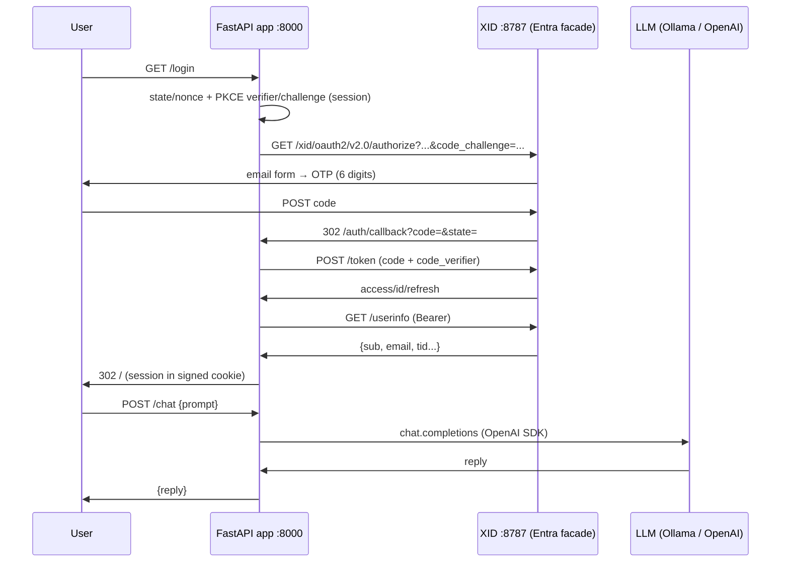

# Fast-API-AI

> Chat WebApp on Python/FastAPI + OpenAI/Ollama + OAuth (OnMind-XID/Entra-ID)

Minimal FastAPI sample app that authenticates via [**OnMind-XID**](https://github.com/kaesar/onmind-xid) (simulating Entra ID)
and exposes a protected chat that calls the LLM.  
By default it uses local **Ollama** (`gemma4:e4b-mlx`) via an OpenAI-compatible
endpoint; setting `LLM_PROVIDER=openai` switches to the **OpenAI API** (`gpt-4o-mini`).

## Structure

```bash
./
├── main.py               # FastAPI + SessionMiddleware, includes router
├── router.py             # to manage: views + auth + chat
├── endpoints/
│   ├── views.py          # GET / (HTML chat) + GET /health
│   ├── auth.py           # /login, /auth/callback, /me, /logout
│   └── chat.py           # POST /chat (protected)
├── app/
│   ├── config.py         # env + URLs derived from the Entra facade
│   ├── auth.py           # PKCE, authorize/token/userinfo, session
│   └── llm_client.py     # openai SDK against Ollama or OpenAI
├── templates/chat.html   # chat UI with CUI as-button/as-text + native fallback
├── static/cui/onmind-cui-v3.js  # vendored OnMind-CUI bundle
├── scripts/test_oauth_flow.py
└── requirements.txt
```

> The vendored bundle mirrors XID's `vendor/cui` pattern.
<!-- `cp ../../ui/cui/dist/onmind-cui-v3.js static/cui/onmind-cui-v3.js` -->

## Flow



## Getting started

Steps to start the services:

```bash
# 1. OnMind-XID (email bob@example.com:abc123 in userbase.txt)
git clone --depth 1 https://github.com/kaesar/onmind-xid.git xid
cd xid && bun install && bun src/dev.js

# 2. This app
cd ../ai
python3 -m venv venv && ./venv/bin/pip install -r requirements.txt
cp .env.example .env   # review APP_SECRET_KEY; defaults already point to XID+Ollama
./venv/bin/python -m uvicorn main:app --host 127.0.0.1 --port 8000
```

> xid serves on `http://localhost:8787`, app serves on `http://localhost:8000`  
> Start **Ollama** if you use a local model (to simulate the **OpenAI API**)

## Try it

1. Open http://localhost:8000 → click **Sign in with OnMind-XID**.
2. Email `bob@example.com`, code `abc123` (dev key from `userbase.txt`,
   no Mailpit needed). With `alice@example.com` the OTP arrives at Mailpit `:8025`.
3. Type a prompt → `gemma4:e4b-mlx` answers via Ollama.
4. `GET /me` shows session + provider; `GET /logout` signs out
   (clears cookie and goes through **OnMind-XID** logout).

## Environment variables (app side, see `.env.example`)

| Variable | Usage |
|---|---|
| `APP_BASE_URL` / `APP_SECRET_KEY` | public base + session cookie signing |
| `XID_BASE_URL` / `XID_TENANT_ID` / `XID_CLIENT_ID` | `http://localhost:8787`, `xid`, `ai-ejercicio` (public client, no secret) |
| `XID_REDIRECT_ALLOWLIST` | **configured on XID in prod** (`XID_REDIRECT_ALLOWLIST=http://localhost:8000/auth/callback,...`); in dev XID leaves it open |
| `LLM_PROVIDER` | `ollama` \| `openai` |
| `OLLAMA_BASE_URL` / `OLLAMA_MODEL` | `http://localhost:11434/v1`, `gemma4:e4b-mlx` |
| `OPENAI_API_KEY` / `OPENAI_MODEL` | only if `LLM_PROVIDER=openai` |

## Endpoints

| Method | Route | Description |
|---|---|---|
| `GET` | `/` | chat UI (HTML+JS) |
| `GET` | `/login` | redirects to XID authorize (PKCE S256) |
| `GET` | `/auth/callback` | code→tokens→userinfo, stores session |
| `GET` | `/me` | session state + LLM info |
| `POST` | `/chat` | `{prompt}` → LLM (401 if unauthenticated) |
| `GET` | `/logout` | clears session + XID logout |
| `GET` | `/health` | health + provider/model |

## Smoke test

```bash
./venv/bin/python scripts/test_oauth_flow.py
```
